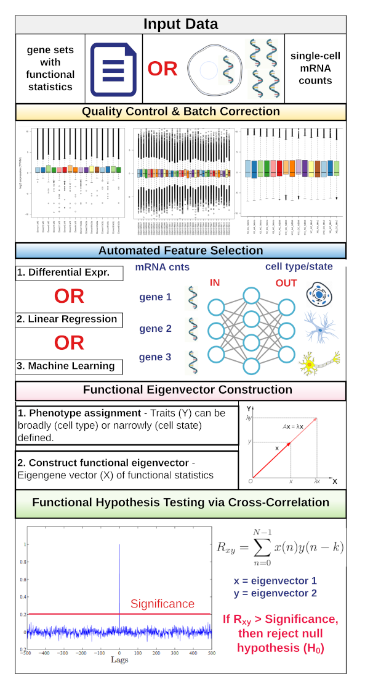
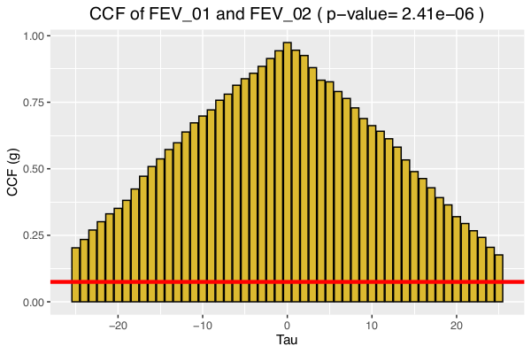
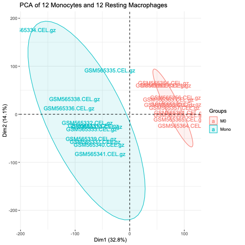
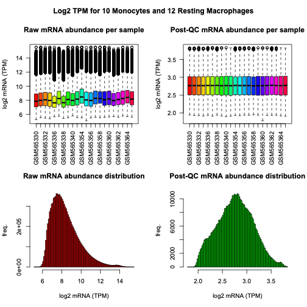
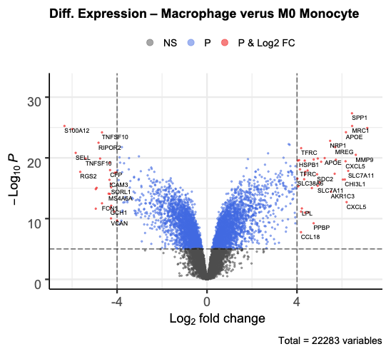
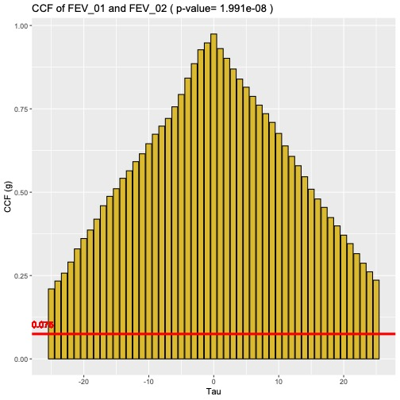
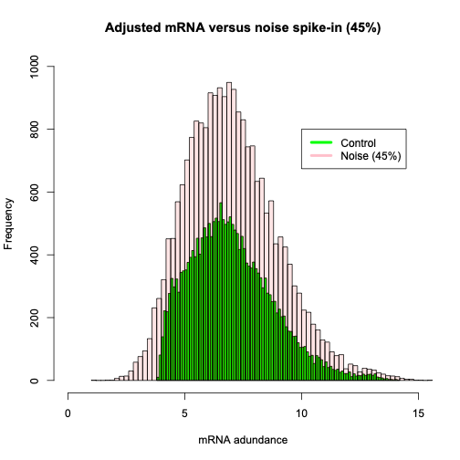

```{r, include = FALSE}
knitr::opts_chunk$set(
  collapse = TRUE,
  comment = "#>"
)
```
```{r setup}
library(SECRETs)
```
# Introduction:

The functional eigenvector (FEV) is the discrete probability mass function of calculated functional association statistics (FAS) for each member (gene, transcript, or protein) of a result set. FEVs act as flexible containers and filters for comparing reference gene expression profiles (RGEPs) derived from functional association summary statistics (text.file) or high-dimensional single-cell RNA sequencing data (scRNA) within and across experiments.

FEVs were born out of necessity. In working with many hundreds of genes and thousands of annotation results, we needed a precise and standardized method for directly comparing and testing functional association statistics at the molecular level. Thus, we developed the FEV as the container and filter for functional hypothesis testing using direct and congruent functional association statistics (FAS). We propose functional eigenvectors as a new and improved paradigm for increasing biological relevance and precision in defining function in an area where multiple hypothesis testing is largely uncontrolled.

# Overview:

### Our novel framework consists of four main components: 

### - Quality control (sample- and transcriptome-wide)
### - Automated variable or gene marker selection
### - Functional eigenvector construction
### - Functional cross-correlation function (CCF) hypothesis testing



## Description

Functional eigenvectors can be constructed from any gene, transcript, or protein list with supplied functional association, rank, or weighting scores. SinglE-Cell deRived EigenTraits or SECRETs are constructed from high-dimensional scRNA counts using differential expression, linear regression, or machine learning algorithms and can be defined at different levels according to the phenotype under study, such as cell type, cell state, treatment or other phenotype. SECRETs provide a precise, standardized, and flexible methodology for defining and directly testing functional associations, terms, and ontologies at the molecular-level within and across experiments.   

## Demonstration 1 - Functional Eigenvectors using Differential Expression Analysis Summary Statistics

### Introduction

To demonstrate the utility and advantage of FEVs, we performed eigenvector construction and CCF hypothesis testing on two RGEPs derived from peripheral blood mononuclear cells (PBMCs). The first text file (RGEP_01.txt) consists of 547 marker genes provided by Abbas et al. (2005). RGEP_01.txt contains log2FC values from 22 distinct PBMCs. The second text file (RGEP_02.txt) consists of 200 marker genes from 80,604 blood cells provided by the Single Cell Expression Atlas (SCEA). Our goal is to demonstrate cell-level specificity by using FEVs to systematically test the correlation of differentially expressed gene markers from two independant studies on PBMCs. 


### Pre-process the data

First, we will load the raw data files and construct functional eigenvectors for the two PBMC DEA statistics.

``` 
library("SECRETs")

test.01.file <- system.file("extdata", "test_01.txt", package = "SECRETs")
test.02.file <- system.file("extdata", "test_02.txt", package = "SECRETs")
PBMC.01.FEV<-loadGeneList(test.01.file)
PBMC.02.FEV<-loadGeneList(test.02.file)
dim(PBMC.01.FEV)
dim(PBMC.02.FEV)
```
### Generate functional eigenvectors

Next, we will join the two FEVs as one data.frame with the generateSECRET() function. The resulting data.frame contains the union of the two gene sets with a column for each of the two functional association statistics. Here, we are using the log fold change (logFC). Non-overlapping genes are assigned a logFC of zero.    

``` 
PBMC.FEV<-generateSECRET(PBMC.01.FEV, PBMC.02.FEV)
head(PBMC.FEV)
```
### CCF hypothesis testing

The FEV cross correlation function (CCF) is our method for functional hypothesis testing. To calculate the CCF of the two FEVs, execute the following code.  Then, we will convert the CCF object to a data.frame.

``` 
CCF.01<-crossCorr(PBMC.FEV, plot=FALSE)
CCF.01.df <- with(CCF.01, data.frame(lag, acf, n.used))
```

Next, we will calculate the significance threshold for the CCF.  The calcCCF_Pvalue() function returns the minimum correlation for statistical significance based on the assumption that the CCF of the null hypothesis is zero. In other words, randomly selected genes would correlate close to zero on average. The CCF significance threshold is two divided by the square root of the number of genes tested. Here, there are 715 distinct gene markers. 

``` 
sig.1 <-calcSignificanceLevel(PBMC.FEV)

```
### Calculate the CCF significance threshold 

We would like to know if any of the genes pass the significance threshold. We can do so by executing the isCCF_Significant() function. 

``` 
isCCF_Significant(CCF.01.df, sig.1)
pval.1<-calcCCF_Pvalue(CCF.01.df)
```
Finally, we can calculate the CCF p-value based on the Z-score of the minimum correlation coefficient as compared to the significance threshold. For this example, we calculated a CCF significance of 0.0747. We assume a normal distribution with a standard deviation of one divided by the square root of the number of observation.    

Now, let's plot the CCF function of the two FEVs. 

``` 
title.1=paste("CCF of FEV_01 and FEV_02 ( p-value=", format(pval.1, digits=4), ")")
plotCorrFunc(CCF.01, sig.1, title.1)

```


## Conclusions

From this plot, we can see that all 32 genes with non-zero logFC values are positively correlated and above the CCF significance threshold. With a p-value of 2.41e-06, we can confidently reject the null hypothesis that these gene markers are uncorrelated. Rather, we postulate that these are all active PBMC markers genes. Next, we will construct FEVs from high-density scRNA counts to decipher monocyte activation states.    

## Demonstration 2 - Functional Eigenvectors for Cell State Resolution using High-density Single-cell RNA (scRNA) Abundance Levels  

### Introduction

To identify conserved gene expression markers and to demonstrate cross-study interpretation of mononuclear cell states, we will create FEVs using DEA on scRNA abundance levels obtained from the Gene Expression Omnibus (GEO). The first dataset is GSE22886 provided by Abbas et al. (2005) and GSE35495 provided by Martinez et al. (2013). GSE22886 provides 12 control monocytes and 12 M0 or resting macrophages. GSE35495 provides 6 control monocytes and 3 M0 macrophages. We will use differential expression analysis (DEA) to construct FEVs and perform functional CCF hypothesis testing for these two studies on cell activation states. To complete this demonstration, you will have to download the two sets of Affymetrix abundance or CEL.gz files. To start, install and load the following libraries.     

``` 
library(affy)
library(affycoretools)
library(sva)
library(hgu133a.db)
library(limma)
library("factoextra")
library("FactoMineR")
library(caret)
``` 
### Pre-process the data 
First, link to the GEO directories containing the CEL files.

``` 
dir.1="/path/GSE22886_RAW"
celFiles.1 <- list.files(dir.1, pattern = "CEL.gz", full.names=TRUE)

dir.2="/path/GSE35495_RAW"
celFiles.2 <- list.files(dir.2, pattern = "CEL.gz", full.names=TRUE)
``` 

Next, load the datasets and run the rma() function. The Robust Mulitchip Average performs robust sample- and transcriptome-wide normalizations as outlined in Irizarry et. al (2003).  

``` 
batch.1 <- ReadAffy(filenames=celFiles.1[1:114])
batch.2 <- ReadAffy(filenames=celFiles.2[1:15])
eset.1 <- affy::rma(batch.1)
eset.2 <- affy::rma(batch.2)
``` 
Reduce the first expression set to 10 control monocytes and 12 M0 macrophages. Two control monocytes were dropped in the sample-level quality control step. 

``` 
samples.1 <- c("GSM565330.CEL.gz", "GSM565331.CEL.gz","GSM565332.CEL.gz","GSM565333.CEL.gz","GSM565336.CEL.gz","GSM565337.CEL.gz","GSM565338.CEL.gz","GSM565339.CEL.gz","GSM565340.CEL.gz","GSM565341.CEL.gz","GSM565354.CEL.gz","GSM565355.CEL.gz","GSM565356.CEL.gz","GSM565357.CEL.gz","GSM565358.CEL.gz","GSM565359.CEL.gz","GSM565360.CEL.gz","GSM565361.CEL.gz","GSM565362.CEL.gz","GSM565363.CEL.gz","GSM565364.CEL.gz","GSM565365.CEL.gz")
eset.1 = eset.1[, sampleNames(eset.1) %in% samples.1]
```

Add the platform annotations. Both experiments were sequenced on the Affymetrix HG-U133A platform.   

``` 
eset.1 <- annotateEset(eset.1, hgu133a.db)
eset.2 <- annotateEset(eset.2, hgu133a.db)
``` 

Next, we'll subset the first matrix to only the relevant samples.

``` 
eset.1.sub = eset.1[, sampleNames(eset.1) %in% samples.1]
``` 
### Sample-level QC
Now let's plot the sample-level principal components. Notice the strong spatial separation and co-localization by cell state (Mono, M0). This gives us confidence in using DEA to identify state-specific markers.  

``` 
X.1 = as.matrix(exprs(eset.1.sub))
X.2 = as.matrix(exprs(eset.2))
res.pca.1 <- prcomp(t(X.1),  scale = TRUE)
res.pca.2 <- prcomp(t(X.2),  scale = TRUE)
fviz_pca_ind(res.pca.1, geom="text",cex=0.8, habillage=label.3, addEllipses=TRUE) + labs(title ="PCA of 12 Monocytes and 12 Resting Macrophages")
```



### Transcriptome-wide QC

From the PCA results, we removed the 2 monocyte outliers. Our transcriptome-wide QC involves removing lowly expressed transcripts, entropy filtering, TMM normalization, and batch correction. The figure below shows the pre- and post-quality control metrics at the sample-level (top) and transcriptome-wide (bottom). Please see the manuscript for additional details.   



Now that the data is cleaned and normalized, we can classify our samples. In this example we used limma for differential expression analysis and marker gene selection. First, we must create the phenotype definitions for each dataset. Remember, we are classifying M0 monocytes against a background of other mononuclear cells.   

### Classification and phenotype marker selection

```
# Assign phenotypes
# Dataset 1 - Abbas (10 controls, 12 M0)
# Dataset 2 - Martinez (12 controls, 3 M0)
pheno.1<-c(rep(0,10), rep(1,12)) 
pheno.2<-c(0,0,0,0,0,0,1,1,1,0,0,0,0,0,0)
design.1 <- model.matrix(~factor(pheno.1))
design.2 <- model.matrix(~factor(pheno.2))

# Run DEA
fit.1 <- lmFit(eset.1.sub, design.1)
fit.2 <- lmFit(eset.2, design.2)
fit.1 <- eBayes(fit.1)
fit.2 <- eBayes(fit.2)
fit.1.df<-topTable(fit.1,coef=2, number=22283)
fit.2.df<-topTable(fit.2,coef=2, number=22283)
```

### Differential Expression Analysis

Let's see a volcano plot of the results. 
```
library(EnhancedVolcano)
volcanoplot(fit.1, highlight=20, coef=2, xlab = "Log2 Fold Change", ylab = NULL, pch=16, cex=0.35, names=fit$genes$SYMBOL)
with(subset(fit.1.df, fit.df$P.Value<0.01 & abs(fit.df$logFC)>2), points(fit.df$logFC, -log10(fit.df$P.Value), pch=20, col="red", cex=0.5))

```



### Generate functional eigenvectors

Now that we have congruent FAS from two independent studies on monocyte activation states, we can construct FEVs for each datset. 

```
# Extract top 1000 transcripts ranked by p-value with logFC values
top.N=1000
M0.a.SECRET<-na.omit(fit.1.df[1:top.N,c(3,5)])
M0.b.SECRET<-na.omit(fit.2.df[1:top.N,c(3,5)])

rownames(M0.01.SECRET)<-make.unique(as.character(M0.a.SECRET$SYMBOL), sep="")
M0.a.SECRET$SYMBOL=NULL
rownames(M0.02.SECRET)<-make.unique(as.character(M0.b.SECRET$SYMBOL), sep="")
M0.0b.SECRET$SYMBOL=NULL

M0.SECRET<-generateSECRET(M0.a.SECRET, M0.b.SECRET)

``` 

### CCF hypothesis testing
```
CCF.M0<- crossCorr(M0.SECRET, plot=FALSE)

```

### Calculate CCF significance threshold
```
sig.M0 <-calcSignificanceLevel(M0.SECRET)
```

#### Calculate the CCF p-value
```
n.used=length(CCF.M0)
CCF.M0 <- with(CCF.M0, data.frame(lag, acf, n.used))
pval.M0<-calcCCF_Pvalue(CCF.M0, n.used)
```


### CCF Interpretation

The CCF reaches a maximum value of just over 0.95 and is well-normalized. All 101 logFC values are positively correlated in the two studies. The CCF p-value provides high statistical confidence in these 101 marker genes as active regulatory proteins in M0 macrophages. Thus, we have provided 101 cross-study consistent gene markers for identifying M0 monocytes. 

### Conclusions

Integrating high-density single-cell mRNA provides three times more conserved marker genes as compared to the analysis of summary statistics derived from bulk tissue, as seen in the previous section. The CCF p-value indicates that the logFC values of these 101 marker genes are highly correlated and associated with M0 macrophages. In fact, all logFC values are positively correlated. All genes (yellow bars in Figure 6) are above the significance threshold (red line). The CCF function is evenly distributed and nearly reaches 1. 

SECRETs (Figure 1) is highly generalizable and extensible to any conceivable cell type, state, treatment, phenotype, or condition that can be observed or measured. SECRETs fill a particular need in biostatistics by providing a simplistic, user-friendly toolkit for analyzing and comparing RGEP derived from association summary statistics or high-density scRNA data.

## Demonstration 3 - Spike-in/Noise Analysis of Differential Expression Analysis (DEA) versus the Support Vector Machine (SVM) Classification

To quantify and compare how DEA and SVM perform under high noise conditions, we spiked-in 45% normally distributed additive noise to the 10 control monocytes and 12 M0 macrophages provided by Abbas et al. (GSE22886). 



```
X1.noise<-addNoise(as.data.frame(X.1), variables = NULL, noise = 45, method = "additive")
X1.n.df<-as.data.frame(X1.noise$xm)
```
### SVM Feature Selection

First, we ran DEA on the scRNA data with noise. Below, we provide the SVM classification with and without noise. We've selected a standard linear SVM model with pre-processing. 10-times cross-validation is performed on 5 sets/theoretical samples.  

```
method="svmLinear"
pp.methods = c("center", "scale", "YeoJohnson", "nzv")

svm.c <- train(
  as.factor(pheno.1)~., data = X.1, method = method,
  scale = FALSE, trControl = trainControl("repeatedcv", number = 10, repeats=5))

svm.n <- train(
  as.factor(pheno.1)~., data = X1.n.df, method = method,
  scale = FALSE, trControl = trainControl("repeatedcv", number = 10, repeats=5))

```
Next, we retrieve the variable (feature) importances scores and convert to a data.frame. 

```
imp.1<- varImp(svm.c, scale=FALSE)
imp.1.df<-as.data.frame(imp.1$importance)
importanceOrder=order(-imp.1.df[,1])
imp.1.df.order<-imp.1.df[importanceOrder,]s

imp.2<- varImp(svm.n, scale=FALSE)
imp.2.df<-as.data.frame(imp.2$importance)
importanceOrder=order(-imp.2.df[,1])
imp.2.df.order<-imp.2.df[importanceOrder,]

```
Count the intersection of the two sets. 

```
top.N=1000
sum(rownames(imp.1.df[1:top.N,]) %in% rownames(imp.2.df[1:top.N,]))

```
### Conclusion

We performed DEA and SVM classification on the control and spiked-in datasets as outlined Demonstrations 2 and 3, respectively. We constructed functional eigenvectors to directly compare control and spiked-in mRNA marker gene signatures using both classification methods. DEA showed a significant increase in the mean p-value and a net reduction (~98%) in significantly DE transcripts. SVM showed a ~53% decrease in theoretical prediction accuracy (10-times cross-fold validation). DEA yielded 41 overlapping transcripts out of the top 1,000 (p-value = 0.304) and SVM yielded 48 overlapping transcripts out of the top 1,000 (p-value = 0.007) most significant transcripts. Based on the greater number of overlapping transcripts and a lower hypergeometric p-value, we conclude that SVM is more robust to noise in these data.     


